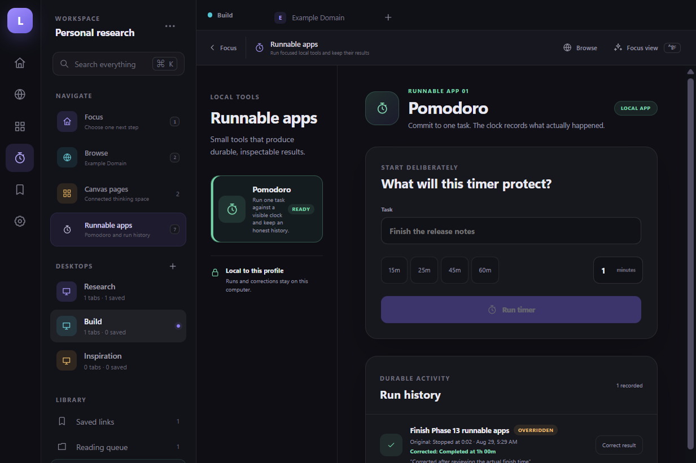

# Lattice — Phase 13

**Status: PASS (2026-08-29).** Lattice is an installable, focus-first personal research browser with
secure native website tabs, restart-safe desktops, Obsidian-compatible saved links, and local
spatial pages made of connected notes, websites, files, objects, and more pages. A read-only local
index now shows backlinks and broken-reference diagnostics without exposing vault paths. Named
website profiles keep personal, work, or client sign-ins and focus context separate. Local runnable
apps now turn focused work into durable activity records, beginning with Pomodoro.



## What works

- Real HTTPS websites render in isolated native `WebContentsView` tabs.
- Up to eight named website profiles can be created and switched from the rail. Each owns distinct
  Chromium cookies, origin storage, cache, tabs, desktops, settings, and focus intention.
- Profiles can use a local picture chosen through a native dialog. Lattice converts it to a bounded
  private PNG and never exposes the source path or stores website passwords/tokens.
- Runnable apps have a dedicated local surface and profile-scoped state. The first app is a
  Pomodoro timer with task naming, custom duration, pause/resume, explicit stop, and explicit
  completion.
- Every stopped or completed timer creates an immutable original result. Corrections are appended as
  visible overrides—such as **Originally stopped at 12m; corrected completed at 1h**—without
  rewriting what was first recorded.
- Focus is a calm return point with one optional local intention and one-action resume choices for
  the active website, next reading item, and latest canvas page.
- Seven labeled destinations remain stable across the rail, workspace panel, internal toolbars, and
  `Alt+1` through `Alt+7` shortcuts—even when a native website has keyboard focus.
- Focus view hides navigation and tab chrome without trapping the user: Save remains available over
  websites, while **Show navigation**, `Escape`, and `Ctrl/Cmd+Shift+F` restore the full shell.
- Internal pages use their own orientation toolbar instead of irrelevant browser controls.
- Tabs retain their URL, active state, and desktop membership across app restarts.
- The global command palette searches actions, desktops, open tabs, saved links, and the web.
- `Ctrl/Cmd+K`, `L`, `T`, and `W` work even while a native website has focus.
- Desktops can be created, safely renamed, and deleted only when they contain no open tabs or saved
  links. Those actions never rename, move, or delete Obsidian folders.
- A live native tab can move to another desktop without reloading or losing its active state.
- A desktop session can be reset with **Close all tabs**.
- An Obsidian vault can be selected once and restored on the next launch.
- Canvas pages are stored as open JSON Canvas `.canvas` files under `Lattice Pages/`, including
  safe nested folders that Obsidian can browse directly.
- Saved links and canvas references form a local index across pages, objects, HTTPS URLs, documents,
  images, and files. Repair diagnostics navigate to the authored source but never rewrite, move, or
  delete Obsidian files.
- A spatial page can contain draggable Markdown note objects, website objects, and typed link-list
  objects. The page title, description, object positions, and timestamps round-trip atomically.
- Link lists support page, object, HTTPS URL, document, image, and file references. Page links open
  another page, object links focus an object, URLs open a new isolated native tab, and local-file
  links reveal a canonical file inside the active vault.
- Website objects never create an iframe in the trusted shell. **Open live** delegates to the same
  locked-down `WebContentsView` boundary used by normal browser tabs.
- Pages can be queued during capture, marked read, or queued again from the local library.
- Saved-link titles and descriptions can be edited after capture through an atomic frontmatter-only
  update; the note path, URL, reading state, filename, folder, and Markdown body are preserved.
- A saved card can open its exact existing note in Obsidian or reveal the Markdown file in Explorer.
  The renderer submits only a stable ID; canonical path resolution and external dispatch stay in the
  trusted main process.
- Reading state lives in the Markdown note and works across every desktop without a private
  database.
- Settings report cookies and cache for the active website profile.
- Website cookies, cache, local storage, IndexedDB, service workers, and related data can be cleared
  through an explicit two-step action without clearing other profiles.
- Tab restoration can be disabled, and a vault can be disconnected without deleting Markdown.
- An assisted current-user Windows installer supports a selectable destination and clean uninstall.
- Installation preserves the byte-exact hardened executable, ASAR, source manifest, and Electron
  fuses; uninstall preserves user data and external Obsidian Markdown.
- Saving a page atomically writes Markdown under `Saved Links/<Desktop>/` with a stable desktop ID,
  URL, title, and description.
- The in-app library reads those files recursively and filters them by desktop or text.
- Phase 0's isolation remains intact: remote pages have no Node, preload, Lattice bridge, filesystem
  access, downloads, popups, device permissions, or non-HTTPS navigation.

## Run it

Prerequisites are Node.js 24+ and pnpm 11.19.0. Install dependencies once:

```powershell
pnpm install --frozen-lockfile
```

Start the high-iteration development loop:

```powershell
pnpm start
```

Renderer edits hot-reload. Main/preload edits rebuild and restart Electron automatically. You do
**not** reinstall Lattice after each change; rebuild the package only when testing packaged
behavior.

Run the quality and release gates:

```powershell
pnpm run check
pnpm run package
pnpm run smoke:packaged
pnpm run installer
pnpm run smoke:installer
pnpm run verify:phase13
```

The unsigned Windows x64 portable app is generated at
`out/Lattice-win32-x64/Lattice.exe`. The assisted installer is generated at
`release/Lattice-Setup-0.13.0.exe`. Windows reputation warnings are expected until a later release
phase adds a protected signing identity. The installer and updater are intentionally not presented
as production distribution yet.

## Evidence and decisions

- [Phase 13 report](docs/phase-13-report.md)
- [Runnable apps screenshot](artifacts/phase-13/runnable-apps.png)
- [Phase 12 report](docs/phase-12-report.md)
- [Website profiles screenshot](artifacts/phase-12/website-profiles.png)
- [Phase 11 report](docs/phase-11-report.md)
- [Phase 10 report](docs/phase-10-report.md)
- [Focus navigation screenshot](artifacts/phase-10/focus-navigation.png)
- [Phase 9 canvas and data report](docs/phase-9-report.md)
- [Packaged smoke evidence](artifacts/phase-9/packaged-smoke-evidence.json)
- [Installed-app smoke evidence](artifacts/phase-9/installed-smoke-evidence.json)
- [Installer lifecycle evidence](artifacts/phase-9/installer-lifecycle-evidence.json)
- [Canvas screenshot](artifacts/phase-9/phase-9-canvas.png)
- [Generated JSON Canvas](artifacts/phase-9/packaged-smoke-canvas.canvas)
- [Installed canvas screenshot](artifacts/phase-9/installed-canvas.png)
- [Real WebContentsView screenshot](artifacts/phase-9/installed-remote-example-com.png)
- [Generated edited Markdown](artifacts/phase-9/installed-smoke-note.md)
- [Remaining risks](docs/unresolved-risks.md)
- [Architecture decisions](docs/decisions/)
- [Historical Phase 7 report](docs/phase-7-report.md)
- [Historical Phase 3 report](docs/phase-3-report.md)

The packaged evidence is bound to the exact source manifest used to build it. The smoke gate also
checks Authenticode state, Electron fuses, CSP, session separation, effective remote isolation,
native tab lifecycle, reload reconciliation, command/native-view composition, guarded desktop
deletion, live tab movement, atomic metadata editing with body/path preservation, layout bounds,
safe stable-ID Obsidian/Explorer handoff, JSON Canvas shape, nested page indexing, all typed link
kinds, page/object/file actions, website-object isolation, focus entry/exit, stable destination
shortcuts, screenshot hashes, reading-state transitions, privacy clearing, non-destructive vault
disconnect, and library read-back.
It additionally creates and switches profiles, proves cookie values remain isolated across distinct
persistent partitions, verifies inactive native views stay hidden, checks profile-scoped shell state,
and scans the profile registry for credential-shaped data. The Phase 13 gate additionally runs a
Pomodoro through pause, resume, and stop; appends a one-hour completed correction; proves the original
stopped result remains; verifies profile-scoped persistence; and captures the installed UI.

## Current phase boundary

Phase 13 intentionally does not add downloads, OAuth popups, browser extensions, site permissions,
automatic updates, code signing, full history/scroll restoration, or Chrome-equivalent Safe
Browsing. It also does not claim full compatibility with every third-party JSON Canvas extension or
automatic reference repair. Profile deletion, incognito, Chrome-profile import, provider-account
inspection, popup-based identity flows, background notifications, sound, OS wake locks, cross-device
timer sync, or editable/deletable timer history remain outside this phase. See the risk register
before Phase 14.
