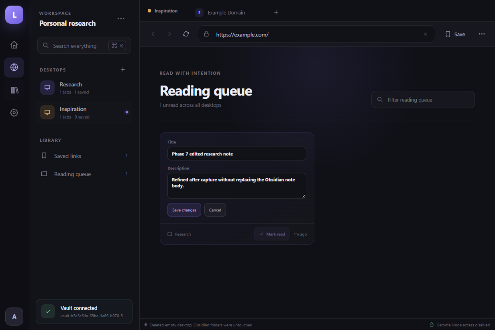

# Lattice — Phase 7

**Status: PASS (2026-08-29).** Lattice is an installable personal research browser with secure native
website tabs, restart-safe desktops, fast local search, Obsidian-compatible saved links, and a
durable reading queue plus explicit privacy controls.



## What works

- Real HTTPS websites render in isolated native `WebContentsView` tabs.
- Tabs retain their URL, active state, and desktop membership across app restarts.
- The global command palette searches actions, desktops, open tabs, saved links, and the web.
- `Ctrl/Cmd+K`, `L`, `T`, and `W` work even while a native website has focus.
- Desktops can be created, safely renamed, and deleted only when they contain no open tabs or saved
  links. Those actions never rename, move, or delete Obsidian folders.
- A live native tab can move to another desktop without reloading or losing its active state.
- A desktop session can be reset with **Close all tabs**.
- An Obsidian vault can be selected once and restored on the next launch.
- Pages can be queued during capture, marked read, or queued again from the local library.
- Saved-link titles and descriptions can be edited after capture through an atomic frontmatter-only
  update; the note path, URL, reading state, filename, folder, and Markdown body are preserved.
- Reading state lives in the Markdown note and works across every desktop without a private
  database.
- Settings report cookies and cache from Lattice's isolated website profile.
- Website cookies, cache, local storage, IndexedDB, service workers, and related data can be cleared
  through an explicit two-step action.
- Tab restoration can be disabled, and a vault can be disconnected without deleting Markdown.
- An assisted current-user Windows installer supports a selectable destination and clean uninstall.
- Installation preserves the byte-exact hardened executable, ASAR, source manifest, and Electron
  fuses; uninstall preserves user data and external Obsidian Markdown.
- Saving a page atomically writes Markdown under `Saved Links/<Desktop>/` with a stable desktop ID,
  URL, title, and description.
- The in-app library reads those files recursively and filters them by desktop or text.
- Phase 0's isolation remains intact: remote pages have no Node, preload, Lattice bridge, filesystem
  access, downloads, popups, device permissions, or non-HTTPS navigation.

## Run it

Prerequisites are Node.js 24+ and pnpm 11.19.0. Install dependencies once:

```powershell
pnpm install --frozen-lockfile
```

Start the high-iteration development loop:

```powershell
pnpm start
```

Renderer edits hot-reload. Main/preload edits rebuild and restart Electron automatically. You do
**not** reinstall Lattice after each change; rebuild the package only when testing packaged
behavior.

Run the quality and release gates:

```powershell
pnpm run check
pnpm run package
pnpm run smoke:packaged
pnpm run installer
pnpm run smoke:installer
pnpm run verify:phase7
```

The unsigned Windows x64 portable app is generated at
`out/Lattice-win32-x64/Lattice.exe`. The assisted installer is generated at
`release/Lattice-Setup-0.7.0.exe`. Windows reputation warnings are expected until a later release
phase adds a protected signing identity. The installer and updater are intentionally not presented
as production distribution yet.

## Evidence and decisions

- [Phase 7 report](docs/phase-7-report.md)
- [Packaged smoke evidence](artifacts/phase-7/packaged-smoke-evidence.json)
- [Installed-app smoke evidence](artifacts/phase-7/installed-smoke-evidence.json)
- [Installer lifecycle evidence](artifacts/phase-7/installer-lifecycle-evidence.json)
- [Metadata editor screenshot](artifacts/phase-7/phase-7-metadata-editor.png)
- [Installed Settings screenshot](artifacts/phase-7/installed-shell.png)
- [Real WebContentsView screenshot](artifacts/phase-7/installed-remote-example-com.png)
- [Generated edited Markdown](artifacts/phase-7/installed-smoke-note.md)
- [Remaining risks](docs/unresolved-risks.md)
- [Architecture decisions](docs/decisions/)
- [Historical Phase 6 report](docs/phase-6-report.md)
- [Historical Phase 3 report](docs/phase-3-report.md)

The packaged evidence is bound to the exact source manifest used to build it. The smoke gate also
checks Authenticode state, Electron fuses, CSP, session separation, effective remote isolation,
native tab lifecycle, reload reconciliation, command/native-view composition, guarded desktop
deletion, live tab movement, atomic metadata editing with body/path preservation, layout bounds,
screenshot hashes, reading-state transitions, privacy clearing, non-destructive vault disconnect,
and library read-back.

## Current phase boundary

Phase 7 intentionally does not add downloads, OAuth popups, browser extensions, site permissions,
automatic updates, code signing, full history/scroll restoration, or Chrome-equivalent Safe
Browsing. Those capabilities require explicit policy and security work; see the risk register
before Phase 8.
